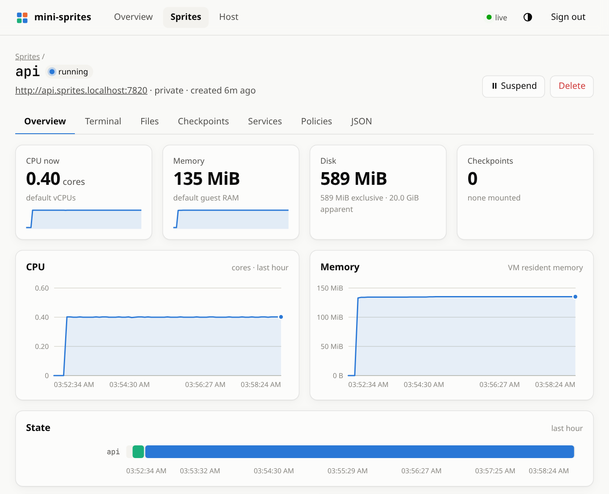

# sandpit

A multi-provider sandbox server on one host: persistent, hardware-isolated Linux environments
on Firecracker microVMs that suspend when idle and wake on the next request. One daemon,
`sandpitd`, speaks the [Sprites](https://sprites.dev), [E2B](https://e2b.dev),
[Vercel Sandbox](https://vercel.com/docs/sandbox), [Daytona](https://daytona.io) and (in part)
[Modal](https://modal.com) APIs, each on a listener of its own, so those providers' official
SDKs and CLIs work against it unmodified.

This is an independent, unofficial project. It is not affiliated with or endorsed by Fly.io,
E2B, Vercel, Daytona or Modal. Their products are theirs; this only implements compatible APIs
for running on your own machine.

```
Sprites SDK / sprite CLI    E2B SDK    Vercel SDK    Daytona SDK    modal client
        │ :7900               │ :7901     │ :7902        │ :7903         │ :7904
        ▼                     ▼           ▼              ▼               ▼
sandpitd ── one front end per API over one engine: wake on request, suspend when idle,
   │        go cold after a TTL; one store, one set of API keys, one dashboard
   │  vsock, both directions (no guest network needed)
   ▼
Firecracker microVM ── sandpit-agent as PID 1 (from an initramfs) ── your ext4 disk
                       └─ /.sprite/api.sock + sprite-env, for use from inside
```

Sprites is the engine's native API, not a compatibility layer bolted on, and the rest of what
the engine does is available through it: checkpoints and instant clones, sandboxes created from
any OCI image, network policy, an event stream and signed webhooks, leases, sprites that create
sprites, public URLs under your own domains with automatic certificates, incremental backups
to S3, and a dashboard. sandpit was cut from [wisp](https://github.com/arugula-salad/wisp), a
Sprites-only server, and keeps everything it had.

## The APIs

Each API is a listener of its own. The Sprites API and the dashboard are always on; the others
are off until you give them an address. They share the data directory, the store and the API
keys, and the dashboard shows every sandbox, but a sandbox belongs to the API that made it: E2B
sandboxes are not in the Sprites API's lists, nor sprites in E2B's.

| API | Listener | Suggested address | Point the SDK at it | Guide |
|---|---|---|---|---|
| [Sprites](https://sprites.dev) | `--listen` (on by default) | `127.0.0.1:7900` | `SPRITES_API_URL=http://127.0.0.1:7900`, `SPRITE_TOKEN` = the token | [below](#use-it), [API coverage](docs/api.md) |
| [E2B](https://e2b.dev) | `--e2b-listen` | `127.0.0.1:7901` | `E2B_API_URL` and `E2B_SANDBOX_URL` = `http://127.0.0.1:7901`, `E2B_API_KEY` = the token | [Using the E2B SDKs](docs/e2b-sdk.md) |
| [Vercel Sandbox](https://vercel.com/docs/sandbox) | `--vercel-listen` | `127.0.0.1:7902` | `VERCEL_TOKEN` = the token, any `VERCEL_TEAM_ID` and `VERCEL_PROJECT_ID`; Python takes a base URL, JS goes through a `fetch` preload | [Using the Vercel Sandbox SDKs](docs/vercel-sdk.md) |
| [Daytona](https://daytona.io) | `--daytona-listen` | `127.0.0.1:7903` | `DAYTONA_API_URL=http://127.0.0.1:7903/api`, `DAYTONA_API_KEY` = the token | [Using the Daytona SDKs](docs/daytona-sdk.md) |
| [Modal](https://modal.com), partial: sandboxes and exec ([plan](docs/plans/modal-parity.md)) | `--modal-listen` | `127.0.0.1:7904` | `MODAL_SERVER_URL=http://127.0.0.1:7904`, `MODAL_TOKEN_SECRET` = the token, any `MODAL_TOKEN_ID` | [Using the Modal client](docs/modal-client.md) |

"The token" is the root token in `~/.local/share/sandpit/token`, written on first start, or a
named key from `sandpitd keys create` ([API keys](docs/api-keys.md)). Each guide covers its
flags and what works, and links to how it differs from the hosted product. To publish an API
behind a TLS-terminating reverse proxy, each has a `--<api>-public-url`
(`--sprites-public-url`, `--e2b-public-url`, `--vercel-public-url`, `--daytona-public-url`).

## Install

Needs Linux with read/write access to `/dev/kvm`, Go, and rootless podman. sandpitd runs as
you; nothing below needs root until the optional step at the end.

```sh
git clone https://github.com/arugula-salad/sandpit && cd sandpit
make deps images          # Firecracker + a guest kernel, then each API's guest disk
make install-service      # build, install as a systemd user service (sandpit.service), start
```

That serves the Sprites API and the dashboard on 127.0.0.1:7900. Turn on the other APIs with
their flags, which the service remembers:

```sh
make install-service FLAGS='--e2b-listen 127.0.0.1:7901 --vercel-listen 127.0.0.1:7902 --daytona-listen 127.0.0.1:7903 --modal-listen 127.0.0.1:7904'
```

`make run` instead of `make install-service` runs it in the foreground, for trying it out.
Either way the data lives in `~/.local/share/sandpit` (`DATA=<dir>` picks another).

Give sandboxes a network (once, needs root). Without it they have no NIC; exec, checkpoints,
sprite URLs and the TCP proxy still work, because those travel over vsock.

```sh
make netd && sudo ./scripts/setup-host.sh
```

More in [host setup](docs/host-setup.md) (networking, and instant copy-on-write clones) and
[operating it](docs/operations.md) (the service, more than one daemon, sharing a host with wisp,
surviving reboots, `sandpitd status`, limits).

## Use it

Everything that speaks the Sprites API needs two things: where the server is, and the token.

```sh
export SPRITES_API_URL=http://127.0.0.1:7900
export SPRITE_TOKEN=$(cat ~/.local/share/sandpit/token)
```

### With the Sprites SDKs

The only change from upstream's docs is the base URL. Python (`pip install sprites-py`):

```python
import os
from sprites import SpritesClient

client = SpritesClient(os.environ["SPRITE_TOKEN"], base_url=os.environ["SPRITES_API_URL"])

sprite = client.create_sprite("dev")                 # a fresh VM; cold until first used
print(sprite.command("uname", "-a").output().decode())   # boots it (~200 ms), runs, returns stdout

sprite.command("sh", "-c", "echo hello > ~/note").run()
print(sprite.command("cat", "/home/sprite/note").output().decode())   # the disk persists across suspends

client.delete_sprite("dev")
```

Leave a sprite alone for 30 seconds and it suspends to disk; the next call wakes it in about
20 ms with its processes and memory intact ([lifecycle](docs/lifecycle.md)).

JavaScript (`npm install @fly/sprites`):

```js
import { SpritesClient } from '@fly/sprites';

const client = new SpritesClient(process.env.SPRITE_TOKEN, { baseURL: process.env.SPRITES_API_URL });

const sprite = await client.createSprite('dev');
const { stdout } = await sprite.exec('uname -a');
console.log(stdout);

await client.deleteSprite('dev');
```

Go (`go get github.com/superfly/sprites-go`):

```go
client := sprites.New(os.Getenv("SPRITE_TOKEN"), sprites.WithBaseURL(os.Getenv("SPRITES_API_URL")))

sprite, err := client.CreateSprite(ctx, "dev", nil)
if err != nil {
	log.Fatal(err)
}
defer client.DeleteSprite(ctx, "dev")

out, err := sprite.CommandContext(ctx, "uname", "-a").Output()
fmt.Print(string(out))
```

### With the `sprite` CLI

It reads the two variables above:

```sh
sprite create dev
sprite exec -s dev -- uname -a
```

### With the E2B SDKs

With `--e2b-listen 127.0.0.1:7901` ([guide](docs/e2b-sdk.md)). Inside, each sandbox runs E2B's
own envd:

```sh
export E2B_API_URL=http://127.0.0.1:7901 E2B_SANDBOX_URL=http://127.0.0.1:7901
export E2B_API_KEY=$(cat ~/.local/share/sandpit/token)
```

```python
from e2b import Sandbox

sbx = Sandbox.create()
print(sbx.commands.run("uname -a").stdout)
sbx.kill()
```

### With the Vercel Sandbox SDKs

With `--vercel-listen 127.0.0.1:7902` ([guide](docs/vercel-sdk.md)). Python takes a base URL:

```python
import asyncio
from vercel import sandbox
from vercel.api import session
from vercel.sandbox import SandboxServiceOptions

# VERCEL_TOKEN = the token; any VERCEL_TEAM_ID and VERCEL_PROJECT_ID
async def main():
    async with session(service_options=[SandboxServiceOptions(base_url="http://127.0.0.1:7902/api")]):
        box = await sandbox.create_sandbox(name="demo")
        print((await box.run_process("uname", ["-a"], capture_output=True)).stdout)
        await box.destroy()

asyncio.run(main())
```

The JS SDK (`@vercel/sandbox`) has no base-URL option; preload the fetch shim from the probe suite:

```sh
export VERCEL_TOKEN=$(cat ~/.local/share/sandpit/token) VERCEL_TEAM_ID=team_local VERCEL_PROJECT_ID=prj_local
VERCEL_SANDBOX_URL=http://127.0.0.1:7902 node --import ./e2e/providers/vercel/target.mjs app.mjs
```

### With the Daytona SDKs

With `--daytona-listen 127.0.0.1:7903` ([guide](docs/daytona-sdk.md)):

```sh
export DAYTONA_API_URL=http://127.0.0.1:7903/api
export DAYTONA_API_KEY=$(cat ~/.local/share/sandpit/token)
```

```python
from daytona import Daytona

daytona = Daytona()
sbx = daytona.create()
print(sbx.process.exec("uname -a").result)
daytona.delete(sbx)
```

### With the Modal client (partial)

With `--modal-listen 127.0.0.1:7904` ([guide](docs/modal-client.md)). Sandboxes and exec work
with the unmodified `modal` client; Functions, image builds and the files API do not yet
([what is missing](docs/providers/modal-differences.md), [the plan](docs/plans/modal-parity.md)).

```sh
export MODAL_SERVER_URL=http://127.0.0.1:7904 MODAL_TOKEN_ID=sandpit
export MODAL_TOKEN_SECRET=$(cat ~/.local/share/sandpit/token)
```

```python
import modal

app = modal.App.lookup("demo", create_if_missing=True)
sb = modal.Sandbox.create("sleep", "infinity", app=app, image=modal.Image.debian_slim())
print(sb.exec("uname", "-a").stdout.read())
sb.terminate()
```

### In a browser

sandpitd serves a dashboard on the Sprites listener: open <http://127.0.0.1:7900/> and paste
the token. It shows every sandbox, from every API, and the host at a glance, with an hour of
CPU, memory, disk and state history, request traffic and latency, and lets you open a terminal
in any sandbox, browse its files, take and restore checkpoints, and edit its policies
([web UI](docs/web-ui.md)).

<picture>
  <source media="(prefers-color-scheme: dark)" srcset="docs/images/dashboard-dark.png">
  
</picture>

<table><tr>
<td width="50%"><picture>
  <source media="(prefers-color-scheme: dark)" srcset="docs/images/sprite-dark.png">
  
</picture></td>
<td width="50%"></td>
</tr></table>

### Sprite URLs

Every sprite has a URL that wakes it and proxies to port 8080 inside it (or to the service you
mark with `http_port`):

```sh
sprite exec -s dev -- sh -c 'mkdir -p ~/site && echo hi > ~/site/index.html'
sprite exec -s dev -- sprite-env services create web --cmd python3 \
  --args "-m,http.server,8080,--directory,/home/sprite/site" --http-port 8080
curl -H "Authorization: Bearer $SPRITE_TOKEN" http://dev.sprites.localhost:7900/
```

To serve them on the internet under your own domain, over HTTPS, without exposing the API:
[public sprite URLs](docs/public-urls.md). A sprite can also answer at custom domains of its
own (`game.example.com`), each with its own certificate: [custom domains](docs/public-urls.md#custom-domains).
The other APIs' port and preview URLs work the same way on their own listeners.

## Documentation

| | |
|---|---|
| [Host setup](docs/host-setup.md) | Guest networking and the reflink volume: the two optional steps that need root once |
| [Operating it](docs/operations.md) | Running as a service, more than one daemon, sharing a host with wisp, reboots, `sandpitd status`, limits, disk pressure, what is not built |
| [Lifecycle](docs/lifecycle.md) | `running` / `warm` / `cold`, what keeps a sprite awake, tasks, leases, what a sprite costs in memory, autoscale |
| [API keys](docs/api-keys.md) | Named, revocable admin and read-only keys (`sandpitd keys`), and serving the API in public with `--api-listen` / `--api-host` |
| [Web UI](docs/web-ui.md) | The browser dashboard: what it shows, how it signs in, reaching it from another machine |
| [Sprites API coverage](docs/api.md) | What is implemented, and `sprite-env` for use from inside a sprite |
| [Container images](docs/images.md) | Creating a sprite from any image (`"from": {"image": "node:22"}`), the image cache, each API's guest disk |
| [Events and webhooks](docs/events.md) | Our own addition: a live event stream (SSE) of everything that happens to sprites, and signed webhooks |
| [Public sprite URLs](docs/public-urls.md) | A wildcard domain, automatic certificates, the listener that serves only sprite URLs, a TLS-terminating proxy, and custom domains |
| [Backups](docs/backups.md) | Incremental, deduplicated backups to any S3-compatible bucket, and restoring onto a new host |
| [Security](docs/security.md) | How network policy is enforced, how each Firecracker is confined, and what neither covers |
| [Differences from hosted Sprites](docs/differences.md) | Deliberate ones, and the official Go SDK issues this server works around |
| [Using the E2B SDKs](docs/e2b-sdk.md) | `--e2b-listen`: the E2B API for the official E2B SDKs, with E2B's own envd in the guest, and [how it differs from hosted E2B](docs/providers/e2b-differences.md) |
| [Using the Vercel Sandbox SDKs](docs/vercel-sdk.md) | `--vercel-listen`: the Vercel Sandbox API for the official Vercel SDKs, and [how it differs from hosted Vercel](docs/providers/vercel-differences.md) |
| [Using the Daytona SDKs](docs/daytona-sdk.md) | `--daytona-listen`: the Daytona API, for the official Daytona SDKs, and [how it differs from hosted Daytona](docs/providers/daytona-differences.md) |
| [Using the Modal client](docs/modal-client.md) | Partial: `--modal-listen` runs the unmodified `modal` client's sandboxes and exec; [how it differs from hosted Modal](docs/providers/modal-differences.md) and [the plan to parity](docs/plans/modal-parity.md) |
| [Development](docs/development.md) | The code's layout (`engine/`, `frontend/`, `cmd/sandpitd`), tests, the e2e suites against the official SDKs, extra dev stacks |
| [Feature brief](docs/feature-brief.md) | History: the proposal, written for wisp, that leases, forks and keys came from |
